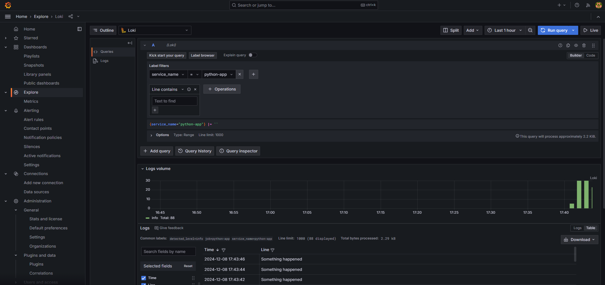

# Loki Quickstart: log from Python
This app was taken from the [Loki quickstart](https://grafana.com/docs/loki/latest/get-started/quick-start/) and modified to log from Python.

## Run the app
1. Run the app with `docker-compose up`
2. Visit [http://localhost:3000](http://localhost:3000) and login with `admin`/`admin`
3. Go to Explore and query `{service_name="python-app"}`

